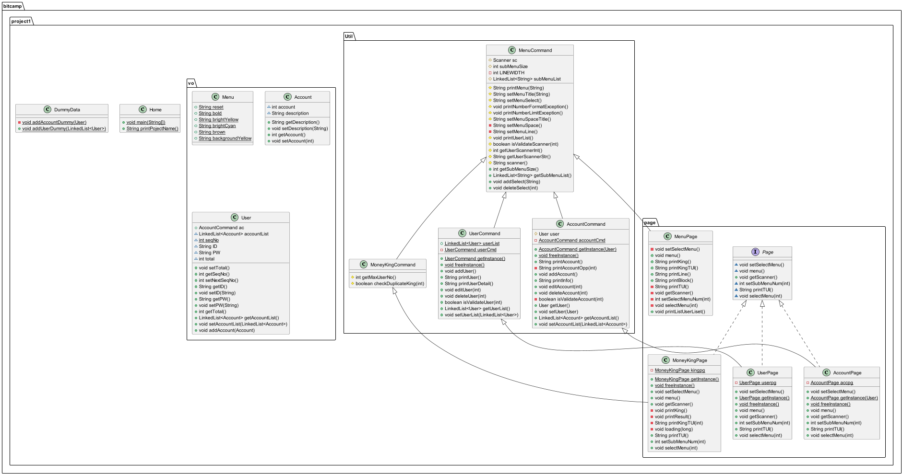

##  bitcamp-project1

<blockquote>
  <ul>
    <li> 팀명: 미래의 부자들</li>
    <li> 팀원: 장혜정 이선아</li>
  </ul>
</blockquote>

## 가계부 만들기
```
· ··÷¦÷·· ·· ··÷¦÷·· ·· ··÷¦÷·· ·
     <<<< MONEY KING >>>>
    💵 팀명: 미래의 부자들
    💵 팀원: 장혜정 이선아
· ··÷¦÷·· ·· ··÷¦÷·· ·· ··÷¦÷·· ·
```

## 화면 구성

### 메인

```
++++++++++++++++++++++++++++++++++++++++++++++++++++++++++++++++++++++++
  ___  ___ _____  _   _  _____ __   __     _   __ _____  _   _  _____      
  |  \/  ||  _  || \ | ||  ___|\ \ / /    | | / /|_   _|| \ | ||  __ \     
  | .  . || | | ||  \| || |__   \ V /     | |/ /   | |  |  \| || |  \/     
  | |\/| || | | || . ` ||  __|   \ /      |    \   | |  | . ` || | __      
  | |  | |\ \_/ /| |\  || |___   | |      | |\  \ _| |_ | |\  || |_\ \     
  \_|  |_/ \___/ \_| \_/\____/   \_/      \_| \_/ \___/ \_| \_/ \____/     

++++++++++++++++++++++++++++++++++++++++++++++++++++++++++++++++++++++++

[1] 가계부       [2] 거지들       [3] ️️✌️거지왕✌️     [0] 종료     
+------------------------------------------------------------------------+
> 
```

## 거지 목록

```
+------------------------------------------------------------------------+
[거지 목록]
[1] Cookie          
[2] Waffle          
[3] Pudding         
[4] Cake            
[5] Candy           
+------------------------------------------------------------------------+
0을 입력하면 메인 메뉴로 돌아갑니다.
> 1
```

## 가계부 CRUD

```
+------------------------------------------------------------------------+
|                           [Cookie          ]                           |
+------------------------------------------------------------------------+
     1) -1400      
     2) -300       
     3) +1000       
     4) +500        
 TOTAL: -200       

[1] 기록        [2] 상세        [3] 수정        [4] 삭제        [0] 종료     
+------------------------------------------------------------------------+
> 
```

## 거지들 CRUD

```
+------------------------------------------------------------------------+
|                           [The future kings]                           |
+------------------------------------------------------------------------+
[1] Cookie          
[2] Waffle          
[3] Pudding         
[4] Cake            
[5] Candy           

[1] 추가        [2] 상세        [3] 수정        [4] 삭제        [0] 종료     
+------------------------------------------------------------------------+
> 
```

## 거지왕

```
이달의 거지왕은..
                 /\         /\         /\
                /  \       /  \       /  \
               /    \     /    \     /    \
              /      \   /      \   /      \
             /        \ /        \ /        \
            /                                \
           \           이달의 거지왕          / 
            \              Cookie            /
             \                              / 
               =============================
。.。:+* ゜ ゜゜ *+:。.。:+* ゜ ゜゜ *+:。.。.。:+* ゜ ゜゜

                Cookie님 축하드립니다!!!
    이번달 총 지출 810원으로 최우수 거지가 되셨습니다.

。.。:+* ゜ ゜゜ *+:。.。:+* ゜ ゜゜ *+:。.。.。:+* ゜ ゜゜


[1] -1400      :지하철        
[2] -300       :버스비        
[3] 1000       :용돈         
[4] 500        :Cookie     
[5] 1010       :부자         
```

## 주요 기능

- **가계부** : User별 가계부 CRUD 기능.
- **거지들** : User CRUD 기능.
- **거지왕** : 등록된 가계부들 중에서 가장 절약한 User를 이달의 거지왕으로 선정.

## 아키텍쳐
## App
<table>
  <tr>
    <th>Home</th>
  </tr>
  <tr>
    <td>메인</td>
  </tr>
</table>

<table>
  <tr>
    <th>DummyData</th>
  </tr>
  <tr>
    <td>더미데이터</td>
  </tr>
</table>

### page

<table>
  <tr>
    <th>
      Page
    </th>
  </tr>
  <tr>
    <td align="center">«interface»</td>
  </tr>
  <tr>
    <td>
        +void setSelectMenu()<br>
        +void menu()<br>
        +public void getScanner()<br>
        +int setSubMenuNum(int)<br>
        +String printTUI()<br>
        +void selectMenu(int)<br>
    </td>
  </tr>
</table>
<br>
<table>
  <tr>
    <th>AccountPage</th>
  </tr>
  <tr>
    <td>가계부 CRUD 페이지</td>
  </tr>
</table>
<br>
<table>
  <tr>
    <th>MenuPage</th>
  </tr>
  <tr>
    <td>
      Main Menu 페이지
    </td>
  </tr>
</table>

```
--------------------------------------
+String printKing()
+String printKingTUI()
+String printLine()
+String printBlock()
+void printListUserLiset()
--------------------------------------
```
<br>
<table>
  <tr>
    <th>MoneyKingPage</th>
  </tr>
  <tr>
    <td>거지왕 선별 페이지</td>
  </tr>
</table>

```
--------------------------------------
+void printKing()
+void printResult()
+String printKingTUI(int)
+void loading(long)
--------------------------------------
```
<br>
<table>
  <tr>
    <th>UserPage</th>
  </tr>
  <tr>
    <td>거지 CRUD 페이지</td>
  </tr>
</table>

### util

<table>
  <tr>
    <th>AccountCommand</th>
  </tr>
  <tr>
    <td>
      가계부 동작<br>
    </td>
  </tr>
</table>

```
--------------------------------------
-User user

+String printAccount()
+String printAccountOpp(int)
+void addAccount()
+String printInfo()
+void editAccount(int)
+void deleteAccount(int)
+isValidateAccount(int)
--------------------------------------
```
<br>
<table>
  <tr>
    <th>MenuCommand</th>
  </tr>
  <tr>
    <td>Main Menu 동작</td>
  </tr>
</table>

```
--------------------------------------
-LinkedList<String> subMenuList
-int subMenuSize
-final int LINEWIDTH

+String printMenu(String)
+String setMenuTitle(String)
+String setMenuSelect()
+void printNumberFormatException()
+void printNumberLimitException()
+String setMenuSpaceTitle()
+String setMenuSpace()
+String setMenuLine()
+void printUserList()
+boolean isValidateScanner(int)
+int getUserScannerInt()
+String getUserScannerStr()
+String scanner()
--------------------------------------
```
<br>
<table>
  <tr>
    <th>MoneyKingCommnad</th>
  </tr>
  <tr>
    <td>거지왕 동작</td>
  </tr>
</table>

```
--------------------------------------
+int getMaxUserNo()
+boolean checkDuplicateKing(int)
--------------------------------------
```
<br>
<table>
  <tr>
    <th>UserCommand</th>
  </tr>
  <tr>
    <td>거지 동작</td>
  </tr>
</table>

```
--------------------------------------
-LinkedList<User> userList

+void addUser()
+String printUser()
+String printUserDetail()
+void editUser(int)
+void deleteUser(int)
+boolean isValidateUser(int)
--------------------------------------
```
<br>

### vo

<table>
  <tr>
    <th>AccountCommand</th>
  </tr>
  <tr>
    <td>가계부 Class</td>
  </tr>
</table>

```
--------------------------------------
-int AccountCommand
-String description
--------------------------------------
```
<br>
<table>
  <tr>
    <th>MenuCommand</th>
  </tr>
  <tr>
    <td>Menu Class(color, bold ...)</td>
  </tr>
</table>
<br>
<table>
  <tr>
    <th>User</th>
  </tr>
  <tr>
    <td>거지 Class</td>
  </tr>
</table>

```
--------------------------------------<br>
-LinkedList<Account> accountList<br>
-static int seqNo<br>
-String ID<br>
-String PW<br>
-int total<br>
<br>
+void setTotal()<br>
--------------------------------------<br>
```

